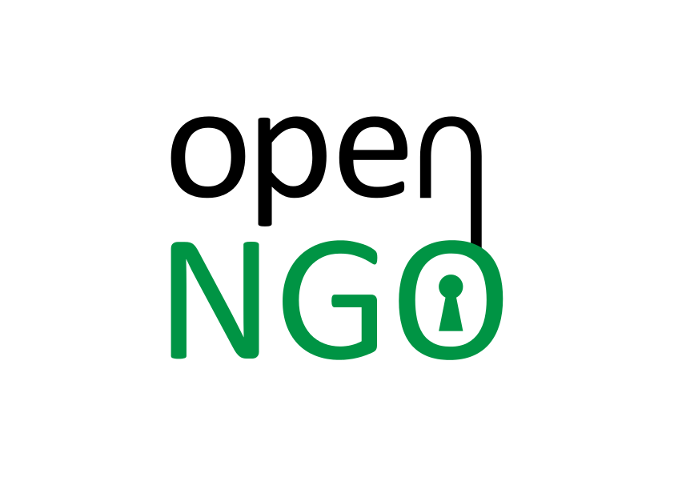

OpenNGO is a free, open source project to help non-governmental organizations (NGOs) best manage their resoures and projects.

OpenNGO is a web-based [Ruby on Rails](https://github.com/rails/rails) app

# RoadMap

## Currently Implemented
- Ability to add Projects
- Ability to add Members
- Ability to add Donors
- Ability to add NGO Branches
- Ability to add Activites, freeform or to project
- Ability to add expenses to an Activity
- Integration with [Trello](http://trello.com)

## TODO  V 1.0
- ability to add milestones

# How to contribute
OpenNGO is a ruby on rails project, so ruby is a requirement, as well as git. Detailed instructions can be found in our [contribution guide](CONTRIBUTING.md)
